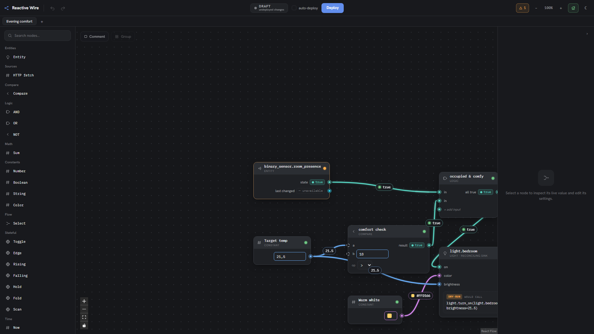

<p align="center">
  
</p>

# Reactive Wire

A node-based **reactive** automation system for Home Assistant. Instead of scripting
transitions, you wire a typed graph where an entity's desired state is *derived* from the
combined current state of other entities. Any input change re-derives the output.

<p align="center">
  
</p>

See [DESIGN.md](./DESIGN.md) for the full design and rationale.

## Status

Works end to end: build a typed reactive graph in the editor, point nodes at your real
entities, and deploy it to a server that actuates Home Assistant live.

- **One engine** (`shared/engine/evaluate.ts`) powers both the editor's live preview and
  the server's actuation. Every value is `ok` / `unavailable` / `error`, propagating with
  Kleene 3-valued logic so an offline sensor never silently reads `false` and actuates wrong.
- **Reconciling sinks** call a service only when actual state differs from desired state, and
  never on a non-`Ok` value (safety).
- **Editor** (React Flow): drag nodes from a palette, connect typed pins (type + cycle
  validated), edit values inline, autocomplete real entities, live values on every pin.
- **Server**: long-lived-token HA WebSocket — streams a live entity feed, synchronizes the
  collaborative editor document, and actuates on deploy (dry-run preview by default). In-memory
  mock + simulator when no HA is configured.
- **Collaborative persistence**: editor flows/macros sync live between connected browsers and are
  saved to disk so the document survives server restarts.
- **Editable pin values**: input defaults, constants, and compare operands via one mechanism.

See [DESIGN.md §9](./DESIGN.md) for the roadmap.

## Prerequisites

[pixi](https://pixi.sh) manages the Node toolchain and every task — core and editor.
From the project root:

```sh
pixi run install-all     # install core + editor dependencies (cached; re-runs only on manifest/lockfile change)
```

## Commands

Everything runs through pixi. Core (engine + server):

```sh
pixi run test            # run the engine/unit test suite
pixi run typecheck       # type-check the core
pixi run start           # run the server against a live Home Assistant
pixi run check           # typecheck core + editor and run the tests
pixi run e2e             # Playwright browser smoke tests with the mock server + Vite
```

The Playwright suite starts its own mock server and frontend via `e2e/start-app.ts` on isolated default ports (`7421`/`5175`); install the browser once with `npx playwright install chromium` if Playwright asks for it.

Editor frontend (run in ./frontend automatically; auto-installs if needed):

```sh
pixi run storybook       # explore the component library
pixi run build-storybook # static Storybook build
pixi run fe-typecheck    # type-check the editor
pixi run fe-dev          # Vite dev server
```

## Home Assistant add-on

For Home Assistant OS/Supervised installs, the preferred deployment is the add-on in
[`reactive_wire/`](./reactive_wire). It runs the existing Node backend, serves the built editor
through Supervisor Ingress, stores the editor document in `/data`, and uses the Supervisor-provided
Home Assistant API token instead of a long-lived token.

Install it by adding this repository to **Settings → Add-ons → Add-on Store → ⋮ → Repositories**,
then install and start **Reactive Wire**. The add-on metadata points at a prebuilt multi-architecture
GHCR image (`amd64` and `aarch64`); the image itself is built with Pixi from the checked-in
`pixi.lock`.

For local image development, generate the ignored Docker build context first:

```sh
pixi run install-all
pixi run addon-build
```

The packaging step compiles the server, builds the editor with same-origin WebSocket support, writes
a runtime-only npm lockfile, and copies the Pixi manifest/lock plus runtime artifacts into
`reactive_wire/app/`. After starting the add-on, open **Reactive Wire** from the Home Assistant
sidebar. It still starts safe: nothing actuates until you press **Deploy** or enable auto-deploy.

Release flow: run the **Prepare release PR** GitHub Action with the target semver and changelog
notes. The generated PR bumps `package.json`, Pixi/add-on metadata, and the add-on changelog. When
that PR lands on `main`, the **Release add-on image** workflow builds and pushes the multi-arch image,
then tags the repository only after the image push succeeds.

## Running against Home Assistant manually

Copy `.env.example` to `.env` and fill in your instance URL and a long-lived access token:

```sh
cp .env.example .env
# edit .env: HA_URL, HA_TOKEN
pixi run start
```

The server loads `.env` automatically. By default the editor feed/deploy WebSocket binds to
`127.0.0.1:7420`, validates loopback browser origins, and is not exposed to your LAN. If you
intentionally bind it elsewhere with `RW_HOST`, also set explicit `RW_ALLOWED_HOSTS` /
`RW_ALLOWED_ORIGINS` and strongly consider `RW_DEPLOY_TOKEN`; start the editor with the same
value exported as `VITE_RW_DEPLOY_TOKEN` (or put it in `frontend/.env.local`) so it can connect
and deploy.

Inline environment variables still work and take precedence over `.env`:

```sh
HA_URL=http://homeassistant.local:8123 HA_TOKEN=<token> pixi run start
```

Without `HA_URL`/`HA_TOKEN`, the server runs in **mock mode** with simulated entities, so the
editor works as a demo with no Home Assistant. The collaborative editor document is persisted in
`RW_DATA_DIR` (default `.rw-data`, ignored by git) and is loaded again after server restarts. In
production/container setups, point `RW_DATA_DIR` at an absolute path on a durable volume and back up
`editor-doc.ydoc`; it contains the saved editor graph/macros, not HA tokens. Individual client
updates are capped at 2 MB and the compact document state at 8 MB by default; if either limit is hit,
remove large embedded payloads from the document or restore a smaller backup. If a future incompatible
document version is encountered, the server refuses to overwrite it rather than silently resetting the
file. In the default manual mode, the server starts with **no graph deployed** and persisted edits are
not actuated until you Deploy. Enabling **auto-deploy** is durable authorization: that setting is saved
with the document, and a valid enabled graph resumes live actuation after a server restart.

**Safety:** just running the server with a manual-mode document (and the editor's live preview)
**never changes your home** — the auto-started demo graph runs in dry-run. Sinks actuate only after
you **Deploy** or enable **auto-deploy** from the editor. Both are explicit, intentional acts; disable
auto-deploy before shutdown if the graph must not resume after restart.

## Connecting the editor to live Home Assistant

Run the server and the editor together:

```sh
pixi run start     # server: connects to HA (or mock), serves a live entity feed on ws://127.0.0.1:7420
pixi run fe-dev    # editor: http://localhost:5173
```

The editor connects to the feed automatically. When connected it shows **LIVE** and its
entity nodes reflect your real Home Assistant state; with no server it shows **DEMO** and runs
a built-in simulation. The example reads `sun.sun`, `binary_sensor.room_presence`, and
`light.bedroom` — entities you don't have simply read as unavailable.

### Editing and deploying

In the editor you can drag pins to **connect** (invalid types and cycles are refused),
**select**/**delete**, drag nodes, and edit a selected node's config in the **inspector** —
including pointing an entity node at any of your real `entity_id`s. Edits update the live
preview immediately.

Press **Deploy** to send the graph to the server and run it **live** against Home Assistant;
sinks show as live in the editor. **Auto-deploy** is a durable server-owned, synced document setting:
when enabled, the server deploys the configured flow after collaborative graph edits from any client
and resumes that valid live graph after server restart. With auto-deploy off, startup remains
undeployed and edits remain a draft until the next explicit Deploy.

## Layout

```
shared/               neutral engine + types, imported by both editor and server
  engine/evaluate.ts   the single reactive engine (dispatcher)
  engine/nodes/        one self-contained NodeDef per node type (registry)
  value.ts results.ts node-types.ts entities.ts theme.ts macros.ts   shared model
src/                  server + Home Assistant adapters
  ha/                 HAClient/EntityFeed, MockHA, RealHA (subscribeEntities + callService)
  server/             index (boot), feed (WebSocket), runtime (Deployer), sim
  reactive.ts         cell (live entity storage for the HA layer)
frontend/             the editor (Vite + React + Tailwind v4 + React Flow)
  src/canvas/         React Flow node, validation, palette, inspector, entity picker, popups
  src/components/     ValueChip, Pin, Widgets (value editors), Badges, Icon, NodeView
  src/canvas/node-templates.ts   registry-derived palette catalog
test/                 engine, stateful, time, variadic, fetch, sinks, macros, poller tests
```
